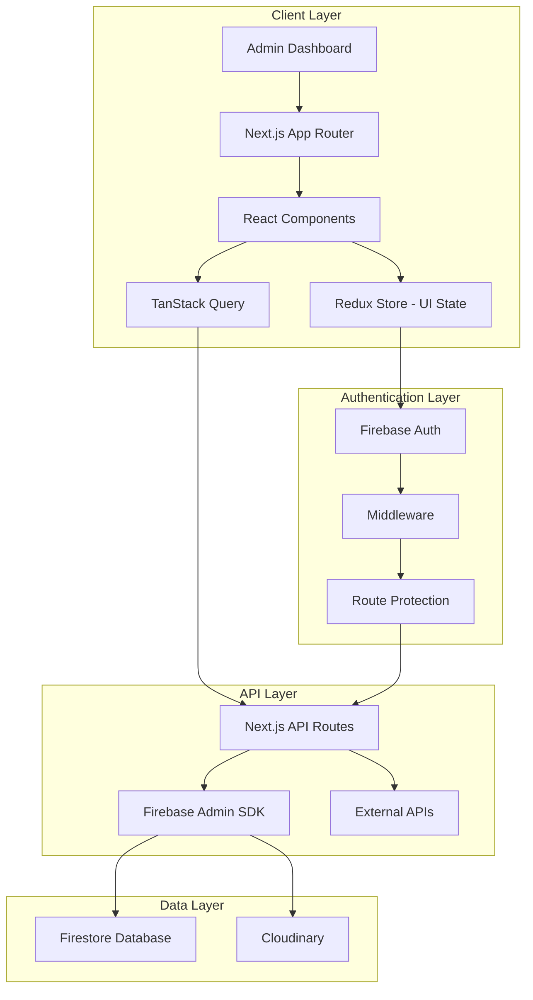
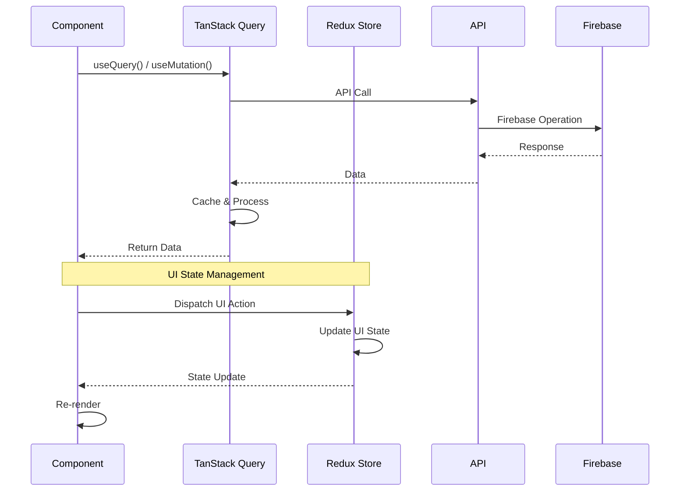
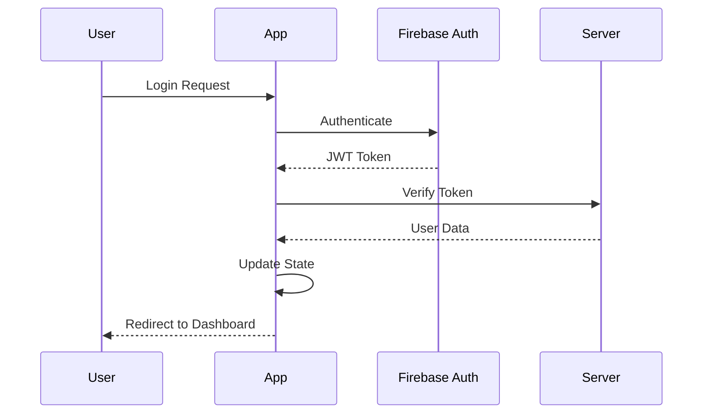
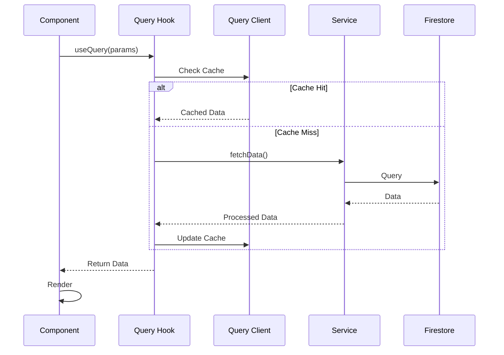

# System Overview

The Tara-Vel Admin system is built with a modern, scalable architecture that leverages Next.js, Firebase, TanStack Query, and Redux to provide a robust administrative interface.

## High-Level Architecture



## Core Components

### Frontend Architecture

#### Next.js App Router Structure
```
src/app/
├── layout.tsx             # Root layout with providers
├── page.tsx               # Home page
├── dashboard/             # Dashboard module
├── users/                 # User management
├── accounts/              # Account management
├── vehicles/              # Vehicle management
├── id-verification/       # Verification workflow
├── system-logs/           # System monitoring
├── auth/                  # Authentication pages
└── api/                   # API routes
```

#### Component Architecture
```
src/components/
├── ui/                    # Reusable UI components
├── layout/                # Layout components
├── dashboard/             # Dashboard-specific components
├── users/                 # User management components
├── accounts/              # Account management components
├── vehicles/              # Vehicle management components
├── verification/          # Verification components
└── logs/                  # Logging components
```

### State Management

#### TanStack Query + Redux Architecture
The application uses a hybrid state management approach:

- **TanStack Query**: Handles all server state (data fetching, caching, synchronization)
- **Redux**: Manages only UI state (modals, filters, pagination, selections)

#### Redux Store Structure (UI State Only)
```typescript
interface RootState {
  auth: AuthState;           // Authentication state
  users: UsersState;         // UI state for user management
  accounts: AccountsState;   // UI state for account management
  vehicles: VehiclesState;   // UI state for vehicle management
  verification: VerificationState; // UI state for ID verification
  logs: LogsState;          // UI state for system logs
  settings: SettingsState;  // UI state for settings
}
```

#### TanStack Query Structure
```typescript
// Query keys for consistent caching
const queryKeys = {
  verification: {
    all: ["verification"],
    stats: () => ["verification", "stats"],
    list: (filters) => ["verification", "list", filters],
    detail: (id) => ["verification", "detail", id],
  },
  account: {
    all: ["account"],
    list: (filters) => ["account", "list", filters],
    detail: (id) => ["account", "detail", id],
  },
  // ... other entities
};
```

#### State Flow


## Data Flow Architecture

### Authentication Flow


### Data Fetching Flow


## Database Schema

### Firestore Collections

#### Users Collection
```typescript
interface User {
  // Firebase Auth fields
  uid: string;
  email: string;

  // Firestore metadata fields
  name: string;
  role: "admin"; // Only admin role is supported
  createdAt: string;
  status: "active" | "blocked";
  contactNumber?: string;

  // Optional fields
  lastLogin?: string;
  blocked_at?: string;
  blocked_reason?: string;
}
```

#### Accounts Collection
```typescript
interface Account {
  // General properties
  accountId: string;
  accountType: "organization" | "individual";
  serviceType: "bus" | "van";
  username: string;
  accessKeyHash: string;
  displayName: string;
  profilePictureUrl?: string;
  status: "active" | "blocked";
  createdAt: string;
  createdBy: string;
  email?: string;
  contactNumber: string;
  secondaryContactNumber?: string;
  contactPerson?: string;

  // Audit trail fields
  editedAt?: string;
  editedBy?: string;

  organizationId?: string;
  organizationName?: string;
  vehicleTypeId?: string;
  location?: { lat: number; lng: number };
}
```

#### Vehicles Collection
```typescript
interface VehicleType {
  id: string;
  name: string;
  description: string;
  capacity: number;
  seatingArrangement: string;
  vtype: "bus" | "van";
  createdAt: string;
  updatedAt: string;
  status: "active" | "maintenance" | "inactive";
}
```

#### Verifications Collection
```typescript
type IdType = "student" | "senior" | "pwd" | "other";

/**
 * Possible verification status values
 */
type VerificationStatus = "valid" | "invalid" | "pending" | "rejected";

/**
 * Main verification interface
 */
interface Verification {
  // Core identification
  id: string;
  idNumber: string;
  idType: IdType;
  status: VerificationStatus;

  // Timestamps
  timestamp: string; // When initially uploaded
  createdAt?: string;
  updatedAt?: string;

  // Image handling
  imageUrl?: string; // Single primary image URL
  imageUrls?: string[]; // Array of Firebase image URLs

  // User information
  uploaderId: string; // References User.userId (Firebase Auth)
  uploaderName: string; // References User.name

  // Verification details
  rejectionReason?: string; // Required when status is "rejected"

  // Admin verification tracking
  adminVerifierId?: string; // ID of admin who processed the verification
  adminVerifierName?: string; // Name of admin who processed the verification
  verifiedAt?: string; // Timestamp when verification was completed

  // Expiration handling - Single source of truth
  expirationDate?: string; // Date when ID expires (for student IDs)

  // Revalidation system
  needsRevalidation?: boolean;

  // Discount percentage (stored as decimal: 0.20 for 20%)
  discountPercentage?: number;

  // Additional metadata
  ipAddress?: string; // IP address when uploaded (for security)
  userAgent?: string; // Browser/device info when uploaded
}
```

## Security Architecture

### Authentication & Authorization

The Tara-Vel Admin system implements a comprehensive security model with the following key features:

#### Admin-Only Access Control
- **Single Role System**: Only `admin` role is supported for the admin dashboard
- **Automatic Role Validation**: Non-admin users are automatically logged out upon login attempt
- **Session Management**: Real-time monitoring of user status with automatic blocking

#### Authentication Flow
```typescript
// Auth context implementation
export function AuthProvider({ children }: { children: React.ReactNode }) {
  const [user, setUser] = useState<User | null>(null);
  const [profile, setProfile] = useState<FirestoreUserProfile | null>(null);
  
  const fetchUserProfile = async (uid: string) => {
    const userDoc = await getDoc(doc(db, "users", uid));
    const profileData = userDoc.data() as FirestoreUserProfile;
    
    // Check if user is admin - reject all non-admin users
    if (profileData.role !== ROLES.ADMIN) {
      await firebaseSignOut(auth);
      return {
        success: false,
        error: "Access denied. Only admin users can access this system."
      };
    }
    
    return { success: true };
  };
}
```

#### Real-time Status Monitoring
- **Live Block Detection**: Continuous monitoring of user status via Firestore listeners
- **Automatic Session Termination**: Users are immediately logged out if blocked
- **Blocked Page Redirect**: Seamless redirect to blocked status page with reason

#### Authentication Constants
```typescript
// Centralized auth-related constants
export const ROLES = {
  ADMIN: "admin", // Only admin role is supported
} as const;

export const ACCOUNT_STATUS = {
  ACTIVE: "active",
  BLOCKED: "blocked",
} as const;

export const STORAGE_KEYS = {
  USER_PROFILE_PREFIX: "user-profile-",
  BLOCKED_REDIRECT: "blocked-redirect",
} as const;
```

#### Session Management Features
- **Profile Caching**: 5-minute cache for admin profiles to prevent repeated fetches
- **Session Tracking**: Prevents duplicate session logging per browser session
- **Storage Management**: Automatic cleanup of authentication-related cache on logout
- **Error Handling**: Comprehensive logging of authentication events and errors

### Data Security

#### Firestore Security Rules
```javascript
rules_version = '2';

service cloud.firestore {
  match /databases/{database}/documents {
    
    // Helper function to check if user is authenticated
    function isAuthenticated() {
      return request.auth != null;
    }
    
    // Helper function to check if user is admin
    function isAdmin() {
      return isAuthenticated() && 
             exists(/databases/$(database)/documents/users/$(request.auth.uid)) &&
             get(/databases/$(database)/documents/users/$(request.auth.uid)).data.role == 'admin';
    }
    
    // Users collection - Contains both travel users and admin users
    match /users/{userId} {
      // Users can read their own profile, admins can read any profile
      allow read: if isAuthenticated() && 
                     (request.auth.uid == userId || isAdmin());
      
      // Users can create/update their own profile, admins can manage any user
      allow write: if isAuthenticated() && 
                      (request.auth.uid == userId || isAdmin());
    }

    // Allow admins to list all users (for admin dashboard)
    match /users/{document=**} {
      allow read: if isAdmin();
    }
    
    // Verifications collection - Users can create/delete their own, admins can manage all
    match /verifications/{verificationId} {
      // Users can read their own verifications, admins can read all
      allow read: if isAuthenticated() && 
                    (isVerificationOwner(verificationId) || isAdmin());
      
      // Users can create verifications (upload their IDs)
      allow create: if isAuthenticated();
      
      // Users can delete their own verifications, admins can delete any
      allow delete: if isAuthenticated() && 
                      (isVerificationOwner(verificationId) || isAdmin());
      
      // Only admins can update verifications (approve/reject/change status)
      allow update: if isAdmin();
      
      // Helper function to check if user owns the verification
      function isVerificationOwner(verificationId) {
        return isAuthenticated() && 
              exists(/databases/$(database)/documents/verifications/$(verificationId)) &&
              get(/databases/$(database)/documents/verifications/$(verificationId)).data.uploaderId == request.auth.uid;
      }
    }
    
    // Accounts collection - Driver/conductor accounts (not connected to Firebase Auth)
    match /accounts/{accountId} {
      // Allow read access for everyone (public)
      allow read: if true;
      
      // Only authenticated admins can write/update accounts
      allow write: if isAdmin();
      
      // Only authenticated admins can delete accounts
      allow delete: if isAdmin();
    }
    
    // Vehicles collection - Admin management
    match /vehicles/{vehicleId} {
      allow read: if true;
      
      // Only admins can create/update vehicles
      allow write: if isAdmin();

      // Only authenticated admins can delete vehicles
      allow delete: if isAdmin();
    }
    
    // Log audit collection - Admin read-only access
    match /log_audit/{logId} {
      // Only admins can read audit logs
      allow read: if isAdmin();
      
      // Only allow writes for audit logging (server-side or admin)
      allow write: if isAdmin();
    }
    
    // Images collection - Multiple access patterns
    match /images/{imageId} {
      allow read: if isAuthenticated() && 
                     (get(/databases/$(database)/documents/users/$(request.auth.uid)).data.role == 'user' || 
                      get(/databases/$(database)/documents/users/$(request.auth.uid)).data.role == 'admin') ||
                  // Unauthenticated access for account collection users
                  (request.auth == null && isAccountAccessAllowed(imageId));
      
      // Only authenticated admins can write
      allow write: if isAuthenticated() && 
                     get(/databases/$(database)/documents/users/$(request.auth.uid)).data.role == 'admin';
      
      // Helper function to check account/organization access for unauthenticated users
      function isAccountAccessAllowed(imageId) {
        let imageData = get(/databases/$(database)/documents/images/$(imageId)).data;
        let imageAccountId = imageData.accountId;
        
        // Check if there's an account document that matches the image's accountId
        let accountDoc = get(/databases/$(database)/documents/accounts/$(imageAccountId));
        
        return exists(/databases/$(database)/documents/accounts/$(imageAccountId)) &&
               // For organization accounts: image accountId matches organizationId
               (accountDoc.data.organizationId == imageAccountId ||
                // For individual accounts: image accountId matches account document ID
                imageAccountId == imageAccountId);
      }
    }
    
    // Deny all other access
    match /{document=**} {
      allow read: if true;
      allow write, update, delete: if false;
    }
  }
}
```

#### Security Features
- **Role-based Access Control**: Admin-only access for administrative operations
- **User Data Isolation**: Users can only access their own data
- **Admin Write Access**: Only admins can modify critical data
- **Audit Trail Protection**: Log audit collection is admin-only

## Performance Architecture

### Caching Strategy
- **Client-side caching** with Redux store
- **Image optimization** with Cloudinary

### Optimization Techniques
- **Code splitting** with Next.js dynamic imports
- **Image optimization** with Next.js Image component
- **Lazy loading** for non-critical components

## Deployment Architecture

## Monitoring & Observability

### Logging Strategy
- **Application logs** via Firebase
- **Performance monitoring** with Vercel Analytics
- **Error tracking** with built-in error boundaries
- **User activity tracking** for audit trails

### Health Checks
- **System health endpoints** for monitoring
- **Database connectivity checks**
- **External service status monitoring**

---

*Next: Learn about the [Tech Stack](tech-stack.md) in detail.*
