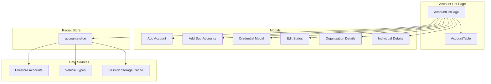

# Account Management

The Account Management section handles both organization accounts and individual accounts, including sub-accounts. It includes credential generation, status control (active/blocked), organization details, and pagination with filtering.

## Overview

- **Account Types**: Organization and Individual
- **Service Types**: Bus or Van
- **Sub-Accounts**: Create accounts under an organization
- **Credentials**: Securely generate credentials and view them in a modal
- **Status Control**: Active / Blocked with audit fields
- **Filtering & Search**: By status, account type, service type, plus search in table
- **Pagination**: Client-side paging per current dataset

## CRUD Operations

### Create
- Add Organization or Individual
- For Organization: sub-accounts can be added after creation
- Credentials: generate and show via Credential Modal (copy-once UX)

### Read
- List view with pagination and filter panel
- Table supports in-row actions: view, edit, add sub-account, delete
- Detail modals for Organization and Individual accounts

### Update
- Edit account status (active/blocked)
- Edit account details (contact info, display name, service type)
- Edit organization details and manage sub-accounts

### Delete
- Delete account (with confirmation modal)
- Cascade considerations: sub-accounts visibility and organization relations

## Search & Filtering

### Search (table-level)
- Search across `displayName`, `username`

### Filters (slice-level)
- **Status**: all, active, blocked
- **Account Type**: organization, individual
- **Service Type**: all, bus, van

### Pagination
- Page, pageSize with hasNextPage/hasPrevPage indicators

## Data Flow

### Account Management Architecture

## Usage Guide

### Managing Accounts
1. Open Accounts in the sidebar
2. Adjust filters (status, account type, service type)
3. Use table search to find specific accounts
4. Use actions to View / Edit / Add Sub-Account / Delete

### Credential Handling
- Use the Credential Modal to view generated credentials
- Copy credentials securely; they may not be shown again

## Troubleshooting

- Accounts not updating? Refresh or clear browser session storage
- Search not finding expected results? Check filters and search field
- Permission errors? Ensure admin authentication and role

---

*Next: Learn about [User Management](user-management.md).*
