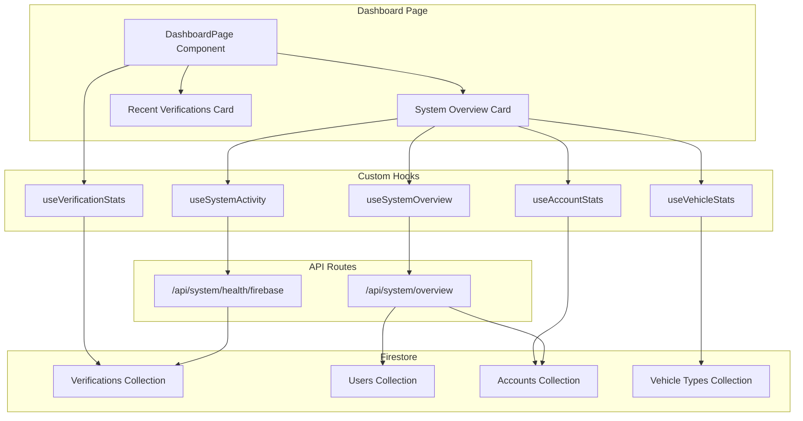

# Dashboard

The Dashboard is the central hub of the Tara-Vel Admin system, providing administrators with real-time insights into system performance, verification activity, and key metrics. It serves as the primary interface for monitoring and managing the entire Tara-Vel platform.

## Overview

The Dashboard serves as the landing page for authenticated administrators, offering comprehensive monitoring and management capabilities:

- **System Overview** - Health checks, domain status, and system performance monitoring
- **Verification Statistics** - Real-time metrics for pending, approved, rejected, and attention-needed verifications
- **Recent Activity** - Latest verification submissions and system events
- **Quick Actions** - Direct navigation to key management sections
- **Real-time Updates** - Live data refresh and caching for optimal performance

## Dashboard Components

### System Overview Card

The System Overview Card provides comprehensive system health monitoring and performance metrics.

**Key Features:**
- **Firebase Health Monitoring** - Real-time Firebase Auth and Firestore status
- **Domain Connectivity Checks** - Website domain availability
- **Vercel Deployment Status** - Production deployment monitoring
- **System Performance Metrics** - Response times and latency tracking
- **Manual Refresh Capability** - Force refresh all system data

### Data Sources:
- `/api/system/overview` - Aggregated system status
- `/api/system/health/firebase` - Firebase service health
- `/api/system/health/domain` - Domain connectivity status
- `/api/system/deployment/vercel` - Deployment status

### Statistics Cards

Four interactive metric cards providing real-time verification statistics with clickable navigation.

**Cards Overview:**

#### 1. Needs Attention Card
- **Purpose**: Highlights verifications requiring immediate admin action
- **Metrics**: 
    - Expired verifications count
    - Revalidation-needed verifications count
- **Visual**: Yellow warning icon with border
- **Action**: Clickable - navigates to ID Verification page with "attention" tab
- **Data Source**: `useVerificationStats` hook

#### 2. Pending Verifications Card
- **Purpose**: Shows verifications awaiting admin review
- **Metrics**: 
    - Total pending verifications count
    - "Awaiting review" description
- **Visual**: Blue clock icon with border
- **Action**: Clickable - navigates to ID Verification page with "pending" status filter
- **Data Source**: `useVerificationStats` hook

#### 3. Verified IDs Card
- **Purpose**: Displays successfully approved verifications
- **Metrics**: 
    - Total approved verifications count
    - Success rate percentage
- **Visual**: Green check circle icon with border
- **Action**: Display only (non-clickable)
- **Data Source**: `useVerificationStats` hook

#### 4. Rejected IDs Card
- **Purpose**: Shows rejected verification attempts
- **Metrics**: 
    - Total rejected verifications count
    - "Rejected verifications" description
- **Visual**: Red X circle icon with border
- **Action**: Display only (non-clickable)
- **Data Source**: `useVerificationStats` hook

## CRUD Operations & Navigation

### Read Operations (Dashboard Display)

The Dashboard primarily focuses on **Read** operations, displaying real-time data from various sources:

#### Data Retrieval
- **Verification Statistics** - Fetched via `useVerificationStats` hook
- **System Health Data** - Retrieved from `/api/system/overview` endpoint
- **Recent Activity** - Loaded through `fetchVerifications` service
- **Vehicle Statistics** - Retrieved via `useVehicleStats` hook
- **Account Statistics** - Loaded through `useAccountStats` hook
- **System Activity** - Fetched via `useSystemActivity` hook

#### Data Refresh Operations
- **Manual Refresh** - Force refresh all dashboard data
- **Auto-refresh** - Automatic updates every 3 minutes
- **Cache Management** - Session storage for performance optimization
- **Error Recovery** - Retry mechanisms for failed requests

### Navigation Operations (Quick Actions)

The Dashboard provides direct navigation to key management sections:

#### Clickable Statistics Cards
- **Needs Attention Card** → `/id-verification?tab=attention`
- **Pending Verifications Card** → `/id-verification?status=pending`

#### Navigation Features
- **Router Integration** - Uses Next.js router for navigation
- **State Preservation** - Maintains user context across navigation

## Data Flow

### Dashboard Data Architecture

---

*The Dashboard provides comprehensive monitoring and quick access to all Tara-Vel Admin features. Use it as your central command center for platform management.*

---

*Next: Learn about [User Management](user-management.md) features.*
