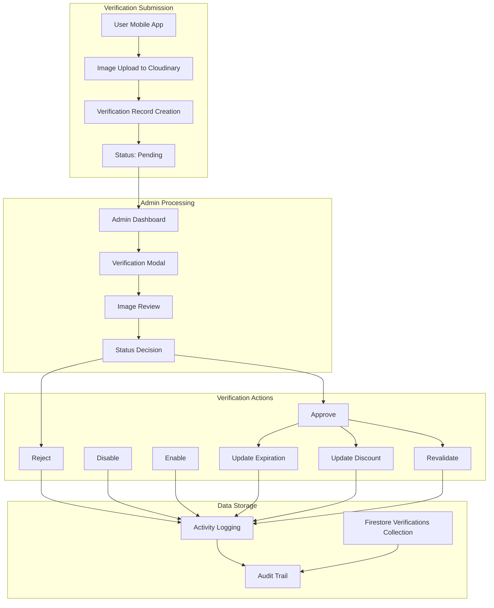
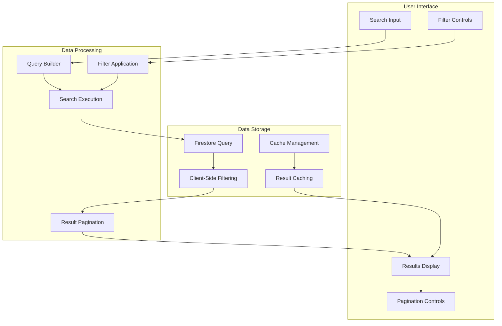

# ID Verification

The ID Verification system is a section for managing the uploaded IDs. It handles the complete lifecycle of ID verification from submission to approval, including status management, expiration tracking, and discount configuration for different ID types.

## Overview

The ID Verification system provides administrators with complete control over user identity verification processes:

- **Verification Management** - Complete CRUD operations for verification records
- **Status Control** - Approve, reject, disable, and re-enable verifications
- **Expiration Tracking** - Manage expiration dates for student IDs
- **Search & Filtering** - Advanced search and filtering capabilities
- **Audit Trail** - Complete activity logging and audit tracking

## Verification Types & Statuses

### Supported ID Types

The system supports three main types of identification documents:

#### 1. Student ID
- **Purpose**: Academic institution identification
- **Expiration**: one academic year
- **Revalidation**: Required periodic revalidation

#### 2. Senior Citizen ID
- **Purpose**: Government-issued senior citizen identification
- **Expiration**: No expiration date required
- **Revalidation**: Required periodic revalidation

#### 3. PWD (Person with Disability) ID
- **Purpose**: Government-issued disability identification
- **Expiration**: No expiration date required
- **Revalidation**: Required periodic revalidation

### Verification Statuses

#### 1. Pending
- **Description**: Newly submitted verification awaiting admin review
- **Actions Available**: Approve, Reject
- **Next Status**: Valid (approved) or Rejected (rejected)

#### 2. Valid
- **Description**: Successfully verified and active ID
- **Actions Available**: Update Expiration, Update Discount, Disable ID, Revalidate
- **Next Status**: Invalid (disabled) or remains Valid

#### 3. Invalid
- **Description**: Disabled verification requiring resubmission
- **Actions Available**: Enable ID, Update Expiration
- **Next Status**: Valid (re-enabled)

#### 4. Rejected
- **Description**: Verification rejected with reason
- **Actions Available**: None (permanent rejection)
- **Next Status**: None (final status)

## CRUD Operations

### Create Operations

#### New Verification Submission
- **Source**: User mobile app submissions
- **Process**: Automatic creation via Firebase and Cloudinary integration
- **Required Fields**: ID number, ID type, image URLs, uploader information
- **Status**: Automatically set to "pending"

### Read Operations

#### Verification Listing
- **Pagination**: infinite scrolling
- **Search**: Search by ID number, uploader name, ID type, admin who processed verification
- **Filter**: Filter by status, ID type, etc.
- **Sorting**: Supported sorting by timestamp, updated date, expiration date, or ID number
- **Order**: Ascending or descending
- **Caching**: Query cache for performance optimization

#### Individual Verification Details
- **Modal View**: Detailed verification information
- **Image Display**: High-resolution ID image viewing
- **History Tracking**: Complete audit trail
- **Status Information**: Current status and related metadata

#### Statistics & Analytics
- **Dashboard Integration**: Real-time verification statistics
- **Status Counts**: Pending, valid, invalid, rejected counts

### Update Operations

#### Status Updates
- **Approve Verification**: Change status from "pending" to "valid"
- **Reject Verification**: Change status from "pending" to "rejected"
- **Disable Verification**: Change status from "valid" to "invalid"
- **Enable Verification**: Change status from "invalid" to "valid"

### Delete Operations

#### Verification Removal
- **Access**: Admin-only operation
- **Process**: Permanent deletion from database
- **Audit**: Complete deletion logging
- **Recovery**: No automatic recovery (permanent action)

## Search & Filtering Capabilities

### Search Functionality

#### Text Search
- **ID Number**: Search by verification ID number
- **Uploader Name**: Search by user name
- **ID Type**: Search by ID type (student, senior, pwd)
- **Case Insensitive**: Search works regardless of case
- **Partial Matching**: Supports partial text matching

#### Search Implementation
- **Client-Side Filtering**: Real-time search results
- **Performance**: Optimized for large datasets
- **Caching**: Search results cached for performance
- **Debouncing**: Prevents excessive API calls

### Filtering Options

#### Status Filters
- **All**: Show all verification statuses
- **Pending**: Show only pending verifications
- **Approved**: Show only approved verifications
- **Rejected**: Show only rejected verifications

#### ID Type Filters
- **All**: Show all ID types
- **Student**: Show only student ID verifications
- **Senior**: Show only senior citizen ID verifications
- **PWD**: Show only PWD ID verifications

#### Date Range Filters
- **Date From**: Filter verifications from specific date
- **Date To**: Filter verifications to specific date
- **Timestamp Based**: Uses verification submission timestamp
- **Range Validation**: Ensures valid date ranges

## Data Flow

### Verification Processing Architecture

### Search & Filter Data Flow

## Usage Guide

### Verification Management

#### Accessing ID Verification
1. **Login** - Authenticate with admin credentials
2. **Navigate** - Go to ID Verification section
3. **View List** - See all verification submissions
4. **Apply Filters** - Use search and filter options

#### Processing Verifications

##### Approving Verifications
1. **Select Verification** - Click on verification to open modal
2. **Review Details** - Check ID number, type, and image
3. **Approve** - Click approve button to confirm

##### Rejecting Verifications
1. **Select Verification** - Open verification modal
2. **Review Details** - Identify issues with verification
3. **Reject** - Click reject button to confirm
4. **Enter Reason** - Provide detailed rejection reason

##### Managing Expired Verifications
1. **Filter by Status** - Go to "Needs Attention" Tab
2. **Review Expired** - Check expired IDs

### Search & Filter Usage

#### Basic Search
1. **Enter Search Term** - Type in search box
2. **Select Search Type** - Choose search criteria
3. **View Results** - Review filtered results
4. **Clear Search** - Reset to show all verifications

#### Advanced Filtering
1. **Set Status Filter** - Choose verification status
2. **Set ID Type Filter** - Choose ID type
3. **Set Date Range** - Choose date range
4. **Apply Special Filters** - Use attention-needed filters
5. **Combine Filters** - Use multiple filters together

### Best Practices

#### Verification Processing
- **Review Thoroughly** - Check all verification details before approval
- **Document Reasons** - Provide clear rejection reasons

#### Search & Filter Usage
- **Use Specific Terms** - Use precise search terms for better results
- **Combine Filters** - Use multiple filters for targeted results
- **Clear Filters Regularly** - Reset filters to see all verifications

#### Performance Optimization
- **Use Pagination** - Navigate through results efficiently
- **Clear Cache** - Refresh data when needed
- **Monitor System** - Check for expired verifications regularly

## Troubleshooting

### Common Issues

#### Verification Not Loading
- **Check Authentication** - Ensure admin login is active
- **Verify Permissions** - Confirm admin role assignment
- **Clear Cache** - Refresh browser or clear session storage
- **Check Network** - Verify internet connectivity

#### Search Not Working
- **Check Search Term** - Ensure search term is valid
- **Clear Filters** - Reset all filters to default
- **Check Database** - Verify verification data exists
- **Refresh Page** - Reload the verification page

#### Filter Issues
- **Reset Filters** - Clear all applied filters
- **Check Date Range** - Ensure valid date ranges
- **Verify Status** - Check verification status values
- **Clear Cache** - Remove cached filter data

### Error Handling

#### Verification Processing Errors
- **Network Issues** - Check internet connection
- **Permission Errors** - Verify admin authentication
- **Database Errors** - Check Firestore connectivity
- **Image Loading** - Verify Cloudinary image access

#### Search & Filter Errors
- **Query Timeout** - Reduce search scope or filters
- **Memory Issues** - Clear browser cache
- **Data Inconsistency** - Refresh verification data
- **Cache Corruption** - Clear all cached data

---

*The ID Verification system provides comprehensive management of user identity verification processes. *

---

*Next: Learn about [Vehicle Configuration](vehicle-configuration.md) features.*
