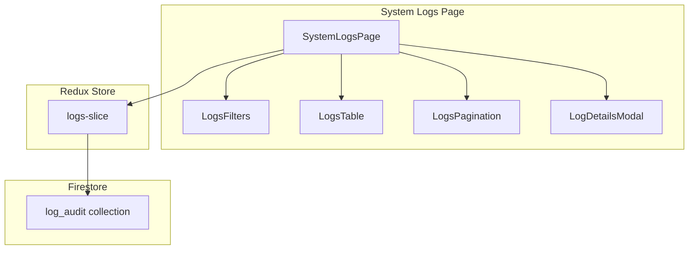

# System Logs

The System Logs feature provides searchable, filterable audit logs with pagination, export, and a details modal for deep inspection.

## Overview

- **Search & Filters**: Search term, date presets/custom range, level, category, action, resource
- **Pagination**: Client-side page/size with next/prev
- **Export**: Export current view to CSV/JSON
- **Details Modal**: Inspect full log entry with metadata
- **Refresh**: Manual refresh with loading indicators

## Search & Filtering

- **Search term**: debounced (300ms)
- **Date range**: presets or custom `dateFrom` / `dateTo`
- **Level**: all | info | warn | error

## Pagination

- Client-side, with `page` and `pageSize`
- Next/Prev buttons and page indicator

## Export

- Export current filtered result set
- CSV or JSON (as implemented)
- Includes headers and timestamps in ISO

## Data Flow

## Usage Guide

1. Adjust filters (level, category, date range, user/email)
2. Use search to narrow by message/content
3. Page through results with Next/Prev
4. Click a row to open the Details modal
5. Export current results when needed

## Troubleshooting

- No results? Loosen filters or date range
- Export disabled? Ensure there are results and you have permissions
- Slow queries? Narrow the date window or filters

---

*Next: Return to the [Dashboard](dashboard.md).*
