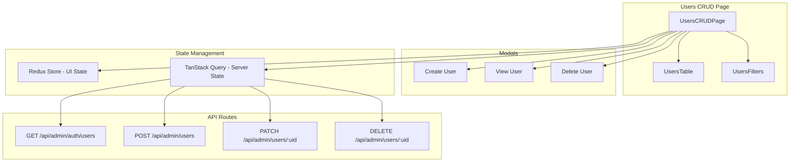

# User Management

The User Management feature provides tools for listing, searching, filtering, viewing, and moderating platform users.

## Overview

- **User List** with search, sorting, and pagination
- **Create User** via modal (email, name, role)
- **View User** details modal
- **Block/Unblock** with reason capture for blocks
- **Delete User** with confirmation
- **Refresh & Pagination** controls
- **Send Email** to users when blocked and unblocked

## Core Operations

### Create
- Open Create User Modal
- Fill email, name, role; submit to create
- List refreshes after success

### Read
- Paginated list (page, pageSize, next/prev)
- Search by name/email; filter by status and role
- View details in a modal

### Update (Moderation)
- Toggle status: active or blocked
- When blocking, admin provides a reason
- Success and error toasts shown; list refreshes

### Delete
- Open Delete User Modal from row action
- Confirm to permanently remove the user

## Filters & Search

- **Status**: all, active, blocked
- **Role**: all, admin
- **Search**: name or email contains query
- Sorting supported via table headers

## Pagination

- Controls: Previous / Next
- Displays current page indicator
- Maintains search/filter state on navigation

## Data Flow

## Usage Guide

1. Use search and filters to narrow users
2. Create new users via the Create modal
3. View details via the View modal
4. Block/Unblock from row actions (add reason for blocks)
5. Delete users with confirmation when needed

## Troubleshooting

- **No results?** 
  - Check filters and search query
  - Verify TanStack Query cache isn't stale
  - Try refreshing the query cache
- **Moderation failing?** 
  - Verify admin permissions and retry
  - Check network connectivity
  - Ensure proper authentication
- **Pagination disabled?** 
  - No previous/next page available
  - Check query parameters
  - Verify data loading state

---

*Next: Return to the [System Logs](system-logs.md).*
