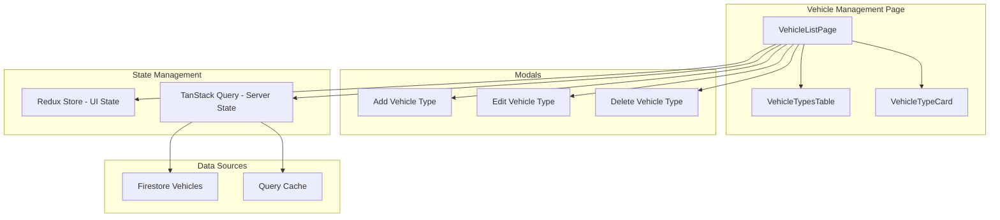

# Vehicle Management

The Vehicle Management section lets administrators manage vehicle types (Bus, Van), including creating, editing, deleting, searching, and filtering vehicle configurations.

## Overview

- **Vehicle Types**: Manage Bus and Van types with capacity, seating arrangement, and status
- **CRUD Operations**: Create, read, update, delete vehicle types
- **Search & Filtering**: Search by name/description; filter by status and vehicle type
- **Views**: Table and cards view with quick actions
- **Caching**: Client-side caching to reduce redundant fetches

## CRUD Operations

### Create
- Open "Add Vehicle Type" modal
- Provide the information required for the vehicle type
- Submit to save; list updates and cache is refreshed

### Read
- Vehicle types list with table/cards toggle
- Pagination handled client-side for current dataset
- Caching: session storage to avoid frequent API calls

### Update
- Click edit on a row/card to open "Edit Vehicle Type" modal
- Update fields and save; state and cache update

### Delete
- Click delete on row/card to open confirmation modal
- Confirm to permanently remove the vehicle type

## Search & Filtering

### Search
- Free-text search across `name` and `description`

### Filters
- **Status**: all, active, maintenance, inactive
- **Vehicle Type**: all, bus, van

### Combined Logic
- Results must match search term AND selected filters

## Data Flow

### Vehicle Management Architecture

## Usage Guide

### Managing Vehicle Types
1. Open Vehicles in the sidebar
2. Use search and filters to narrow results
3. Switch view (Table/Cards) as needed
4. Add/Edit/Delete via the corresponding actions

## Troubleshooting

- **Not seeing updates?** 
  - Use the refresh or clear TanStack Query cache
  - Check if data is cached with stale time
  - Verify query invalidation after mutations
- **Edits not saving?** 
  - Check admin authentication
  - Verify network connectivity
  - Check mutation error handling
- **Missing records?** 
  - Verify filters and search term
  - Check query parameters
  - Ensure proper data loading state

---

*Next: Learn about [Account Management](account-management.md).*
