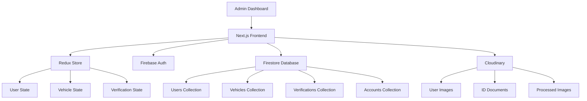

# Overview

Tara-Vel Admin is a comprehensive administrative dashboard designed to manage the Tara-Vel transportation platform. This guide will help you understand the system and get started quickly.

## What is Tara-Vel Admin?

Tara-Vel Admin is a Next.js-based web application that provides administrative tools for:

- **User Management** - Managing platform users and admin
- **Vehicle Management** - Creating and Managing vehicle types (Bus or Van)
- **ID Verification** - Processing and managing identity verification requests
- **Account Management** - Handling organizational accounts and sub-accounts for an organization or individuals that does not belong to an org
- **System Monitoring** - Tracking system health, logs, and performance metrics

## Key Features

### Dashboard
- Real-time system overview
- Key performance indicators
- Recent activity monitoring
- System health status

### User Management
- User creation
- Welcome Email Support
- Blocking and Unblocking

### Vehicle Management
- Vehicle type configuration

### ID Verification
- Document verification workflow
- Approval/rejection workflows

### System Monitoring
- Audit logs
- Activity monitoring

## Architecture Overview

## Technology Stack

### Frontend
- **Next.js 15** - React framework with App Router
- **React 18** - UI library with hooks and context
- **TypeScript** - Type-safe JavaScript
- **Tailwind CSS** - Utility-first CSS framework
- **Radix UI** - Accessible component primitives
- **shadcn/ui** - Pre-built component library

### State Management
- **Redux Toolkit** - Predictable state container
- **React Redux** - React bindings for Redux

### Backend Services
- **Firebase Authentication** - User authentication
- **Cloud Firestore** - NoSQL database
- **Firebase Storage** - File storage
- **Cloudinary** - Image processing and optimization

### Development Tools
- **ESLint** - Code linting
- **Prettier** - Code formatting
- **Husky** - Git hooks
- **TypeScript** - Static type checking

## Getting Started

Ready to start? Follow these steps:

1. **[Installation](installation.md)** - Set up your development environment
2. **[Configuration](configuration.md)** - Configure Firebase and environment variables
3. **[First Steps](first-steps.md)** - Run the application and explore features

## System Requirements

### Development Environment
- **Node.js** 18.17 or later
- **npm** 9.0 or later
- **Git** for version control

### Browser Support
- Chrome 90+
- Firefox 88+
- Safari 14+
- Edge 90+

### Firebase Requirements
- Firebase project with Authentication enabled
- Firestore database configured
- Service account for admin operations

### Cloudinary Requirements
- Cloudinary account

## Next Steps

Once you have a basic understanding of the system:

1. **Set up your development environment** following the [Installation Guide](installation.md)
2. **Configure Firebase services** as detailed in [Configuration](configuration.md)
3. **Explore the architecture** in the [Architecture section](../architecture/system-overview.md)
4. **Learn about core features** in the [Features section](../features/dashboard.md)

## Support

If you need help getting started:

- Check the [Troubleshooting Guide](../troubleshooting/common-issues.md)
- Review the [FAQ section](../appendix/glossary.md)
- Contact the development team
- Open an issue on GitHub

---

*Ready to dive in? Let's start with the [installation process](installation.md)!*
